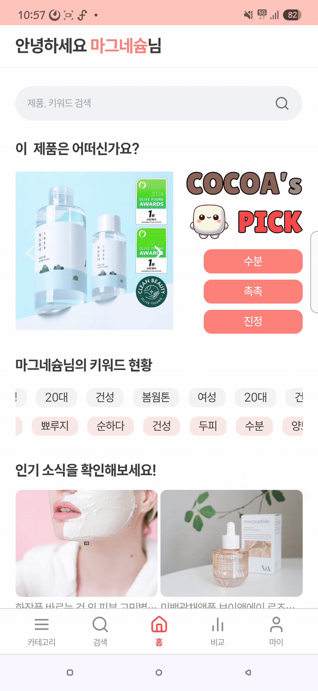
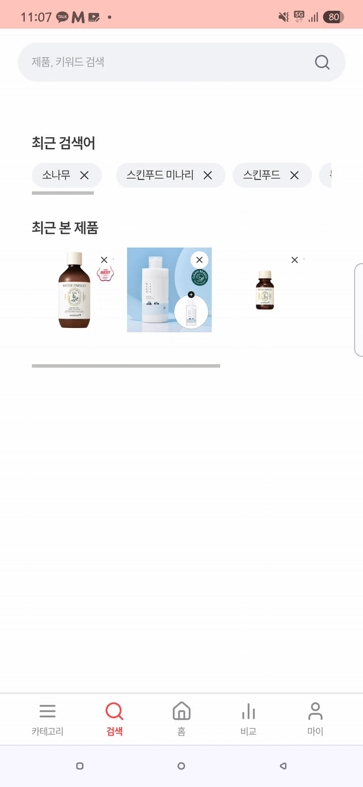
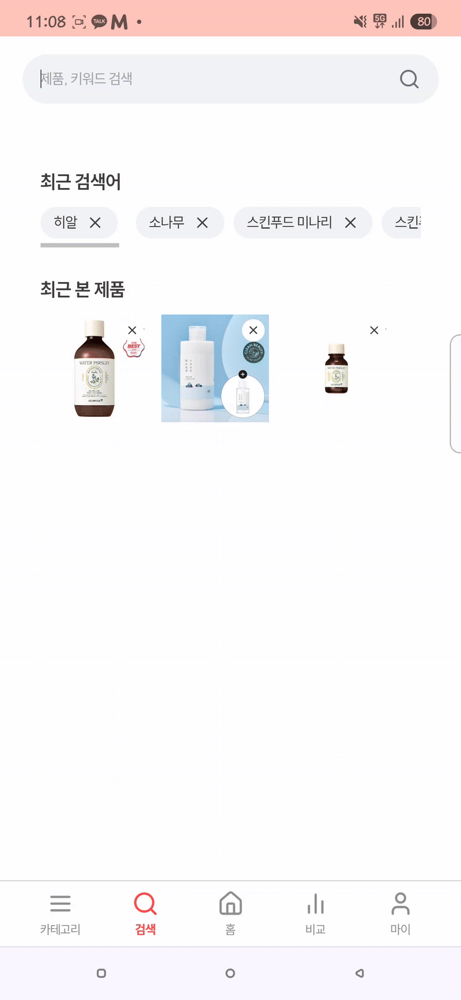
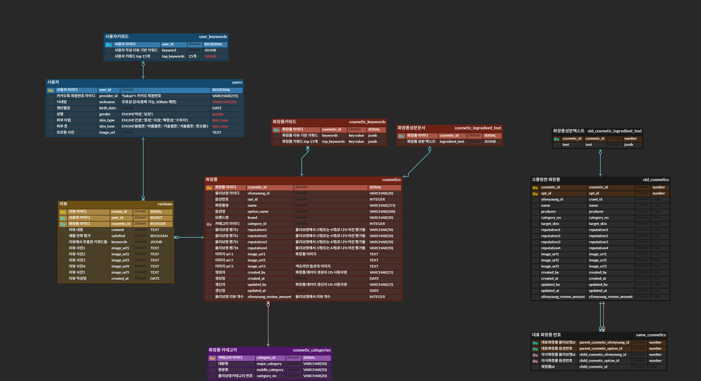

    

## 프로젝트 진행 기간

**2025.02.24 ~ 2025.04.11 (7주)**

## 📌 목차

- [프로젝트 소개](#프로젝트-소개)
- [기능 소개](#기능-소개)
- [기술 스택](#기술-스택)
- [아키텍쳐](#아키텍쳐)
- [명세서](#명세서)
- [ERD](#ERD)
- [팀원](#팀원)

## ✏️프로젝트 소개

    

2019년 코로나로 인해 잠시 주춤했던 화장품 시장이 다시 확대되었습니다.  
국내 화장품 시장 규모가 14% 증가하고, 책임 판매업수가 7배 가량 증가했습니다.  
그에 따라 소비자들은 선택의 폭이 넓게 되었는데요,   
| 나에게 가장 맞는 제품을 무작위가 아니라 원하는 카테고리에 따라 추천해줄 수 없을까?
 

라고 생각하는 소비자를 위해 만들어진    
리뷰 추출 키워드 분석 기반 화장품 추천 서비스 **COCOA** 입니다.
  

## 🚀기능 소개

### 로그인

카카오 소셜 로그인을 통해 손쉽게 회원 가입이 가능합니다.

    

### 카테고리별 맞춤 추천 및 전체 목록 조회

카테고리별로 접속하여 사용자의 키워드와 가장 유사도가 높은 상위 제품 10개를 추천받을 수 있습니다.  
제품의 TOP 키워드 3개를 함께 확인할 수 있으며, 비교함에 담기, 관심 제품으로 등록하기가 가능합니다.  
토글 버튼을 눌러 전체 목록 역시 확인 가능합니다.

    
    

### 제품 비교

비교함에 담은 두 제품의 TOP 키워드 5개 중 자신과 겹치는 키워드가 어떤 것이 있는지 확인이 가능합니다.  
또한 두 제품 간 키워드 비교 및 성분 확인까지 가능합니다.

    

### 검색

엘라스틱 서치를 활용하여 제품명, 제품 키워드, 브랜드명으로 빠르게 제품 검색이 가능합니다. 최근 검색어 최대 20개와 최근 본 제품 최대 5개를 바로 확인할 수 있습니다.  
검색 결과창에서는 제품의 TOP 키워드 3개를 함께 확인할 수 있으며, 비교함에 담기, 관심 제품으로 등록하기가 가능합니다.

    
    
    

### 화장품 키워드 확인 및 리뷰 필터링

화장품 상세 페이지에서 해당 제품의 상위 키워드 15개를 기반으로 만들어진 워드클라우드를 확인할 수 있습니다. 해당 키워드 중에서 자신과 겹치는 키워드가 어떤 것이 있는지 확인이 가능합니다. 또한 키워드를 클릭해 해당 키워드가 언급된 리뷰를 확인하는 것 역시 가능합니다.

    

### 사용자 키워드 확인

사용자가 작성한 리뷰를 기반으로 키워드가 추출되어 마이페이지에서 확인이 가능합니다. 또한 관심 등록한 제품 목록 및 작성한 리뷰도 확인 가능합니다.

    

## ⚙️기술 스택

<table>
    <tr>
        <td><b>Back-end</b></td>
        <td>

 

 

</td>
    </tr>
    <tr>
    <td><b>Front-end</b></td>
    <td>

 

    </td>
    </tr>
    <tr>
    <td><b>Big Data</b></td>
    <td>
    
    
    
    </td>
    </tr>
    <tr>
    <td><b>Infra</b></td>
    <td>

</td>
    <tr>
    <td><b>Tools</b></td>
    <td>
    
    
    

    </td>
    </tr>
</table>

## ⚙️아키텍쳐

## ⚙️명세서
- [기능명세서](https://foggy-currency-878.notion.site/19e5f518a63e81878dd7dff159fd404c)  
- [API 명세서](https://foggy-currency-878.notion.site/api-19e5f518a63e81c982c5ec468127bfaf?pvs=74)

## ⚙️ERD

    

## 👥팀원
**TEAM 브로콜리 너마저**  
- 김민경 : 팀장(PM), Full Stack, 추천 알고리즘 구현, 전체 제품 조회, 관심 제품 등록/해제 구현, 캐싱 처리 구현
- 김민지 : Full Stack, 검색, 최근 검색어, 최근 본 제품 구현
- 최은영 : Full Stack, 로그인, 제품 비교 구현
- 진상하 : Full Stack, 빅데이터 분석 및 처리, 리뷰 구현
- 방승윤 : Infra, 빅데이터 분석 및 처리
- 박가영 : Infra, FE, CI/CD, 워드클라우드 구현
